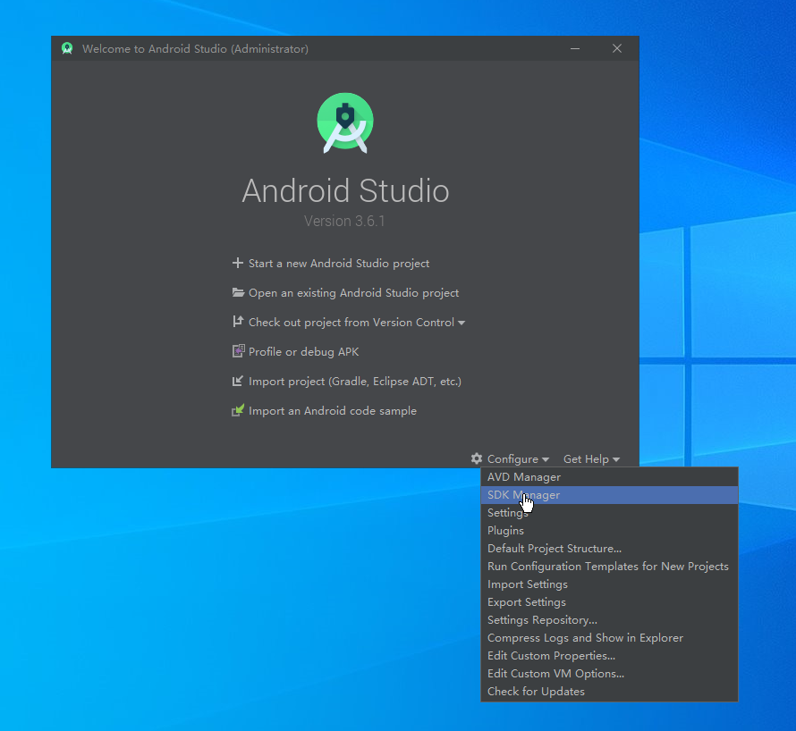
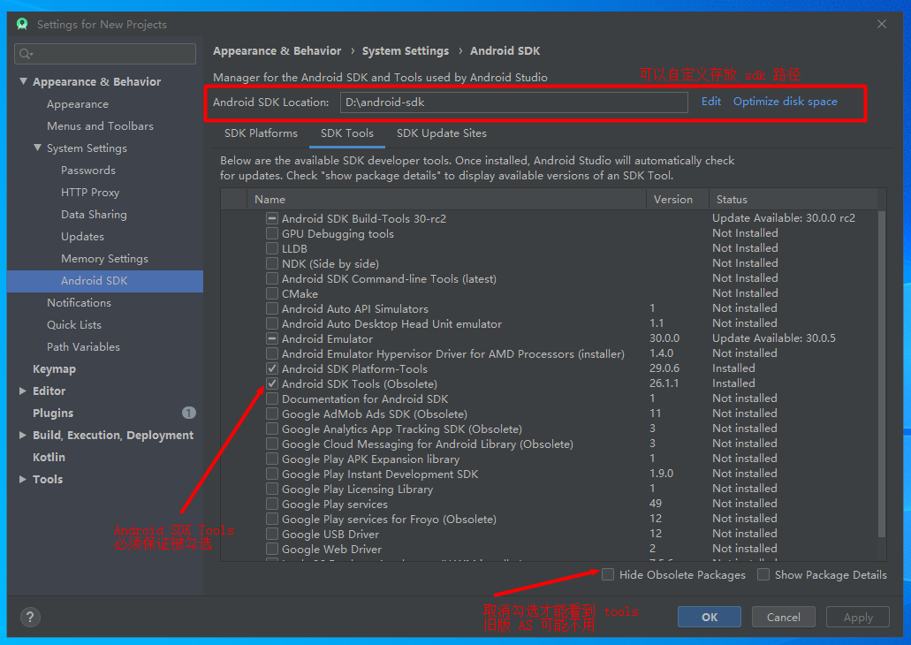
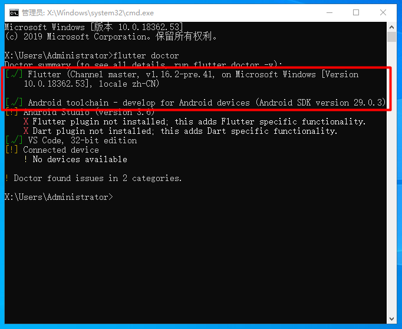

先贴个官方文档, 想要看官方教程的请进 [Flutter 中文网](https://flutterchina.club/)

# Flutter

> Flutter 是谷歌的移动 UI 框架，可以快速在 iOS 和 Android 上构建高质量的原生用户界面。
> Flutter 可以与现有的代码一起工作。
> 在全世界，Flutter 正在被越来越多的开发者和组织使用，并且 Flutter 是完全免费、开源的

# Flutter 安装

- 系统要求

  - 操作系统: Windows 7 或更高版本 (64-bit)
  - 磁盘空间: 400 MB (不包括 Android Studio 的磁盘空间).
  - 装好 git

- 配置镜像, Flutter 可能会需要下载某些插件, 但国内访问 Flutter 会受到限制, 所以使用国内的镜像

  - 将以下路径配置到环境变量中

    | 变量名                   | 变量值                        |
    | :----------------------- | :---------------------------- |
    | PUB_HOSTED_URL           | https://pub.flutter-io.cn     |
    | FLUTTER_STORAGE_BASE_URL | https://storage.flutter-io.cn |

- 获取 Flutter SDK

  _个人推荐使用 git 下载, 因为直接下载解压包的可能还会要初始化 git, 而且还是会有问题_

  ```bash
  git clone git@github.com:flutter/flutter.git
  ```

  `温馨提示: 下载速度不确定, 请准备好大量时间`

  下载完成后, 请在环境变量中配置 Path, Path 值是到你 flutter 的文件夹的 bin 目录, 如下

  ```txt
  D:\Installs\Flutter\flutter\bin
  ```

- 执行 Flutter doctor 检查配置

  - 这一步会提示我们需要 AndroidSDK, 安装 AndroidStudio 即可

- 下载 AndroidStudio

  - [AndroidStudio 官网](https://developer.android.google.cn/studio)

  - 无法访问的请百度自行搜索国内资源

  - 下载好后打开 AndroidStudio, 点击右下方 Configure 中的 SDK Manager, 如图

    

  - 之后进入 sdk 设置路径, 确认 `SDK Platforms` 勾选了一个版本, 然后点击 `SDK Tools` 确保 `Android SDK Tools` 被勾选(如果看不到这项请先取消勾选右下方 Hide Obsolete Packages), 如图

    

- 现在我们需要一个模拟器, 去下载一个手机模拟器吧!

- 一切 OK 的话, 请继续

  - 在命令行中执行以下命令

    ```shell
    flutter doctor
    ```

    可能会需要等待一段时间 ( 准备好瓜子饮料 o(´^｀)o )

    如果出现 `Android license status unknown`, 请在命令行输入以下命令, 可能会有一些提示叫我们选择 Y/N, 一律 Y 即可

    ```shell
    flutter doctor --android-licenses
    ```

    可能会需要等待一段时间 ( 准备好瓜子饮料, 不等待是不可能的, 哈哈 o(´^｀)o )

- 以上步骤执行完成后 再次在命令行中执行 flutter doctor 查看下状态

  如图, 红框内的都打钩表示已完成环境的搭建

  

  至于下面三项, 依次是 AndroidStudio 插件安装, VS Code 插件安装, 和模拟器是否已经开启
  我因为用的是 VS Code, 所以没有去配置 AS, 至于插件的下载, 请自行百度

到此, 优秀的你已经把 Flutter 的开发环境配置好了, 开发工具的话, 我这里推荐 `AndroidStudio` ( AS ) 和 `VS Code` ( VS )

白 (^_−)☆
