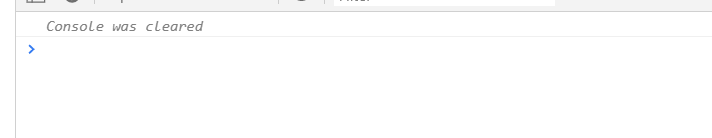
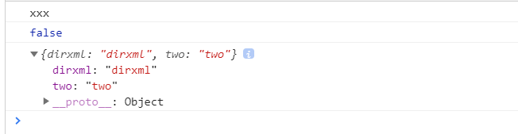

# console

`Console` 对象可以接入浏览器控制台（如：Firefox 的 Web Console）。在不同浏览器上它的实现细节可能是不一样的，但这里会介绍一些典型的浏览器会提供的特性。

`Console` 对象可以从任何全局对象中访问到，如 Window，WorkerGlobalScope 以及控制台属性中的特殊变量。它被定义为 Window.console，而且可直接通过 console 调用。例：

```javascript
console.log("this is a log");
```

# 方法

### `Console.log()` 打印通用的方法

**语法**

> console.log(obj1 [, obj2, ..., objN);<br/>
> console.log(msg [, subst1, ..., substN);<br/>
> console.log('String: %s, Int: %d,Float: %f, Object: %o', str, ints, floats, obj)<br/>
> console.log(`temp的值为: ${temp}`)

```javascript
// 输出对象
console.log({ test: "test" });

// 输出字符串
console.log("String");

// 指定对象的输出格式
var str = 1,
  ints = -6.3,
  floats = 1.1,
  obj = { test: "test" };
console.log(
  "String: %s, Int: %d, Float: %f, Object: %o",
  str,
  ints,
  floats,
  obj
);
// 控制台输出 String: 1, Int: -7, Float: 1.1, Object: {test: "test"}

// 模板字符串模式
console.log(`String: ${str}`);
// 控制台输出 String: 1
```

#### 使用字符串替换有以下类型

| 替换字符串 | 描述                                                   |
| ---------- | ------------------------------------------------------ |
| %o or %O   | 打印 JavaScript 对象，可以是整数、字符串或是 JSON 数据 |
| %d or %i   | 打印整数                                               |
| %s         | 打印字符串                                             |
| %f         | 打印浮点数                                             |

#### 为控制台定义样式 ( 你可以使用 %c 为打印内容定义样式 )

```javascript
console.log(
  "This is %cMy stylish message",
  "color: yellow; font-style: italic; background-color: blue;padding: 2px"
);
```

输出如图  


---

### `Console.info()` 打印资讯类说明信息

_向 web 控制台输出一个通知信息。仅在 Firefox，web 控制台的日志中的项目旁边会显示一个小的‘I‘图标_

**语法**

> console.info(obj1 [, obj2, ..., objN]); <br/>
> console.info(msg [, subst1, ..., substN]);

```javascript
console.info({ info: "info" });
console.info("info1", "info2");
console.info("info");
```

控制台输出如图  


---

### `Console.warn()` 打印一个警告信息

_向 Web 控制台输出一条警告信息。_

**语法**

> console.warn(obj1 [, obj2, ..., objN]);<br/>
> console.warn(msg [, subst1, ..., substN]);

```javascript
console.warn({ warn: "warn" });
console.warn("warn");
```

控制台输出如图  


---

### `Console.error()` 打印一条错误信息

_向 Web 控制台输出一条错误消息。_

**语法**

```javascript
console.error({ error: "error" });
console.error("error");
console.exception({ exception: "exception" });
console.exception("exception");
```

控制台输出如图  


_注意: console.exception() 是 console.error() 的别名；它们功能相同。chrome 未实现_

---

### `Console.dir()` 打印一条以三角形符号开头的语句，可以点击三角展开查看对象的属性

_在控制台中显示指定 JavaScript 对象的属性，并通过类似文件树样式的交互列表显示_

**语法**

> console.dir(object); 打印出该对象的所有属性和属性值

```javascript
console.dir({ dir: "dir" });
```

控制台输出如图  


---

### `Console.debug()` 在控制台打印一条 "debug" 级别的消息

_输出“调试”级别的消息且仅仅控制台配置为显示调试输出时才显示该消息_

**语法**

> console.debug(对象 1 [, 对象 2, ..., 对象 N]);  
> console.debug(消息[, 字符串 1, ..., 字符串 N]);

```javascript
console.debug({ debug: "debug" });
console.debug("debug");
```

控制台输出如图  


若控制台不显示, 可以参照上图, 勾选 Verbose 试试

---

### `Console.assert()` 判断第一个参数是否为真，false 的话抛出异常并且在控制台输出相应信息

_如果断言为 false，则将一个错误消息写入控制台。如果断言是 true，没有任何反应_

**语法**

> console.assert(assertion, obj1 [, obj2, ..., objN]);  
> console.assert(assertion, msg [, subst1, ..., substN]);

```javascript
console.assert(1 === 3, "not true");
console.assert(1 === 3, { assert: "assert", message: "not true" });
```

控制台输出如图  


---

### `Console.count()` 以参数为标识记录调用的次数，调用时在控制台打印标识以及调用次数

_输出 count() 被调用的次数。此函数接受一个可选参数 label_

**语法**

> console.count()  
> console.count(label)

```javascript
console.count();
console.count("count");
console.count("count");
console.count();
console.count();
console.count("count");
console.count();
```

控制台输出如图  


---

### `Console.countReset()` 重置指定标签的计数器值

_重置 console.count()的计数_

**语法**

> console.countReset([label]);  
> _label 一个字符串， 若传入此参数 countReset() 重置此 label 的 count 为 0。若忽略此参数 countReset() 重置 count()默认的 default 字段的 count 为 0_

```javascript
console.count();
console.count("count");
console.count("count");
console.count();
console.count();
console.count("count");
console.count();
console.countReset();
console.count();
```

控制台输出如图  


---

### `Console.clear()` 清空控制台，并输出 Console was cleared

_控制台显示的内容将会被一些信息替换，比如‘Console was cleared’这样的信息_

_需要的注意的一点是在 Google Chrome 浏览器中，如果用户在设置中勾选了“Preserve log”选项，console.clear()将不会起作用_

**语法**

> console.clear();

```javascript
console.count();
console.count("count");
console.count("count");
console.count();
console.count();
console.count("count");
console.count();
console.countReset();
console.count();
console.clear();
```

控制台输出如图  


---

### `Console.dirxml()` 打印 XML/HTML 元素表示的指定对象，否则显示 JavaScript 对象视图

_显示一个明确的 XML/HTML 元素的包括所有后代元素的交互树。 如果无法作为一个 element 被显示，那么会以 JavaScript 对象的形式作为替代。 它的输出是一个继承的扩展的节点列表，可以让你看到子节点的内容_

**语法**

> console.dirxml(object);

```javascript
console.dirxml("xxx");
console.dirxml(false);
console.dirxml({ dirxml: "dirxml", two: "two" });
```

控制台输出如图  


---

### `Console.group()` 创建一个新的内联 group, 后续所有打印内容将会以子层级的形式展示。调用 groupEnd()来闭合组

_在 Web 控制台上创建一个新的分组.随后输出到控制台上的内容都会被添加一个缩进,表示该内容属于当前分组,直到调用 console.groupEnd()之后,当前分组结束._

**语法**

> console.group();

```javascript
console.group();
console.log("xxx");
console.log("xxx");
console.log("xxx");
console.log("xxx");
console.group();
console.log("yyyy");
console.log("yyyy");
console.log("yyyy");
```

控制台输出如图  


---

### `Console.groupCollapsed()` 创建一个新的内联 group。使用方法和 group() 相同，不同的是，groupCollapsed() 方法打印出来的内容默认是折叠的

_在 Web 控制台上创建一个新的分组.随后输出到控制台上的内容都会被添加一个缩进,表示该内容属于当前分组,直到调用 console.groupEnd() 之后,当前分组结束.和 console.group()方法的不同点是,新建的分组默认是折叠的.用户必须点击一个按钮才能将折叠的内容打开._

**语法**

> console.groupCollapsed();

```javascript
console.groupCollapsed();
console.log("xxx");
console.log("xxx");
console.log("xxx");
console.log("xxx");
console.groupCollapsed();
console.log("yyyy");
console.log("yyyy");
console.log("yyyy");
```

控制台输出如图  


---

### `Console.groupEnd()` 闭合当前内联 group

_在 Web 控制台中退出一格缩进(结束分组). 请参阅 console 中的 Using groups in the console 来获取它的用法和示例._

**语法**

> console.groupEnd();

```javascript
console.group();
console.log("xxx");
console.group();
console.log("xxx");
console.group();
console.log("xxx");
console.log("xxx");
console.groupEnd();
console.group();
console.log("yyyy");
console.log("yyyy");
console.log("yyyy");
```

控制台输出如图  


---

### `Console.table()` 将列表型的数据打印成表格

_将数据以表格的形式显示。_

_这个方法需要一个必须参数 data，data 必须是一个数组或者是一个对象；还可以使用一个可选参数 columns。_

_它会把数据 data 以表格的形式打印出来。数组中的每一个元素（或对象中可枚举的属性）将会以行的形式显示在表格中。_

_表格的第一列是 index。如果数据 data 是一个数组，那么这一列的单元格的值就是数组的索引。 如果数据是一个对象，那么它们的值就是各对象的属性名称。 注意（在 FireFox 中）console.table 被限制为只显示 1000 行_

**语法**

> console.table(data [, columns]);
>
> 参数
>
> `data`  
>  要显示的数据。必须是数组或对象。  
> `columns`  
> 一个包含列的名称的数组。

```javascript
let data = ["one", "two", "tree", "four"];
console.table(data);
let data2 = [{ one: "one", two: "two" }, { two: "two" }, { tree: "tree" }];
console.table(data2);
let data3 = { one: data, two: data2 };
console.table(data3);
let data4 = { one: "one", two: "two", tree: "tree" };
console.table(data4);
```

控制台输出如图  


皮了一下, 这个函数太好玩了, 哈哈哈 O(∩_∩)O 哈哈~  
还有更好玩的组合你们随意, 我就不皮了, 点到为止

---

### `Console.time()` 启动一个以入参作为特定名称的计时器，在显示页面中可同时运行的计时器上限为 10,000

_你可以启动一个计时器来跟踪某一个操作的占用时长。每一个计时器必须拥有唯一的名字，页面中最多能同时运行 10,000 个计时器。当以此计时器名字为参数调用 console.timeEnd() 时，浏览器将以毫秒为单位，输出对应计时器所经过的时间。_

**语法**

> console.time(timerName);

```javascript
console.time("tabletime");
console.log("start");
let sum = 0;
for (let i = 0; i < 10000; i++) {
  sum += i;
}
console.log("end");
console.timeEnd("tabletime");
```

控制台输出如图  


---

### `Console.timeEnd()` 结束特定的 计时器 并以豪秒打印其从开始到结束所用的时间

_停止一个通过 console.time() 启动的计时器_

**语法**

> console.timeEnd(label);

```javascript
console.time("tabletime");
console.log("start");
let sum = 0;
for (let i = 0; i < 10000; i++) {
  sum += i;
}
console.log("end");
console.timeEnd("tabletime");
```

控制台输出如图  


---

### `Console.timeLog()` 打印特定 计时器 所运行的时间

_在控制台输出计时器的值，该计时器必须已经通过 console.time() 启动。_

**语法**

> console.timeLog(label);
>
> `label`  
> 计时器索引。

```javascript
console.time("tabletime");
let sum = 0;
for (let i = 0; i < 10000; i++) {
  sum += i;
}
console.timeLog();
console.timeLog("tabletime");
console.timeEnd("tabletime");

console.time();
console.timeLog();
console.timeEnd();

console.timeLog("end");
```

控制台输出如图  


第一个 timeLog 由于没有 console.time() 启动, 所以警告 Timer 'default' does not exist;

第二个 timeLog 传入了有 console.time() 启动的 label 'tabletime', 所以正常运行

第三个 timeLog 有 console.time() 启动, 所以正常运行

第四个 timeLog 传入了 label, 但没有 对应的 console.time() 来启动, 所以警告 Timer 'default' is dose not exist

---

### `Console.trace()` 输出一个 stack trace

_在页面 console 文档中查看堆栈跟踪的详细介绍和示例_

**语法**

> console.trace(); 无参数

```javascript
console.trace();
```

控制台输出如图  


目前整理的常用的 console 用法就这些, 本文参考 MDN
有兴趣的可以移步 [MDN](https://developer.mozilla.org/zh-CN/docs/Web/API/Console), 更多有趣的姿势等你来解锁, bye !
