# MYSQL

## 安装 MYSQL [MYSQL 下载](https://dev.mysql.com/downloads/mysql/)

## 连接 MYSQL

---

打开控制台, 输入以下命令回车, 会叫我们填写密码, 填写好密码回车, 如果没有密码就直接回车

```SQL
mysql -u root -p
```

退出 MYSQL 可用 exit 命令

```SQL
mysql> exit
```

如图是连接成功界面<br/>
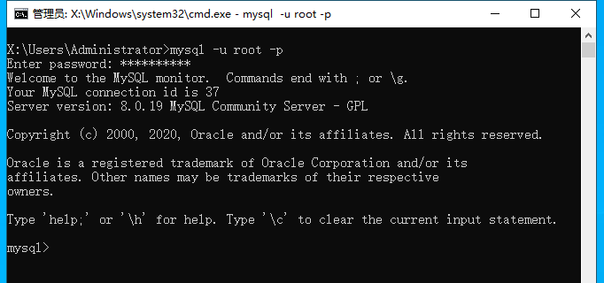

## create 命令创建数据库

---

我们可以在连接好 MYSQL 后, 使用 create 命令创建数据库, 语法如下 :

> CREATE DATABASE 数据库名;

```SQL
CREATE DATABASE databasename;
```

如图是成功创建界面<br/>
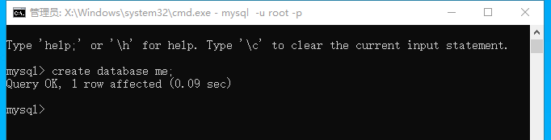

## drop 命令删除数据库

---

语法 :

> DROP DATABASE 数据库名

```SQL
DROP DATABASE me;
```

如图<br/>
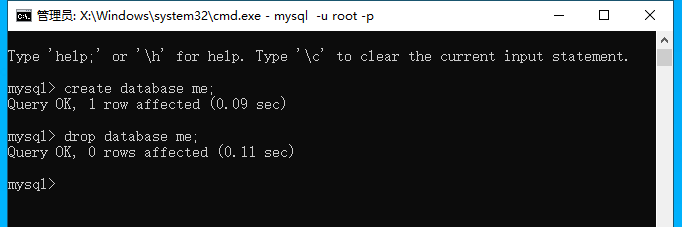

## use 命令选择数据库

---

语法 :

> USE 数据库名;

```SQL
USE me;
```

如图<br/>
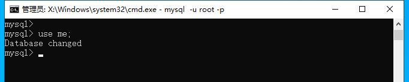

执行完 use 命令后我们就选择了数据库, 后续操作都会在我们选择的这个数据库中执行

## 创建数据表

---

语法 :

> CREATE TABLE table_name (column_name column_type);

```SQL
CREATE TABLE IF NOT EXISTS `table01` (
    id INT AUTO_INCREMENT,
    title VARCHAR(100),
    PRIMARY KEY (id)
);
```

如图<br/>
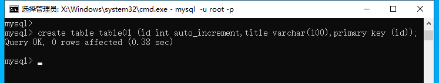

解析 :

- AUTO_INCREMENT 定义列为自增属性, 通常用于主键, 会自动加一
- PRIMARY KEY 关键字, 用于定义列为主键, 可以用多列来定义主键, 列之间用逗号隔开
- IF NOT EXISTS 是判断表是否存在, 如果确定表不存在可以省略

## MYSQL 数据类型 [请移步](https://www.runoob.com/mysql/mysql-data-types.html)

## MySQL 删除数据表

---

语法 :

> DROP TABLE table_name;

让我们来把上面我们创建好的 table01 删了吧

```SQL
DROP TABLE table01;
```

如图<br/>
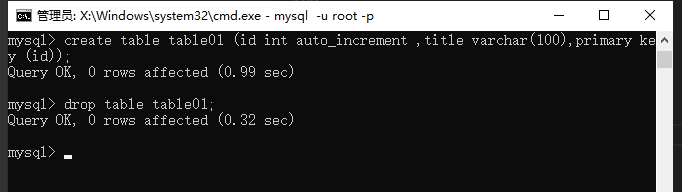

## MySQL 插入数据

---

语法 :

> INSERT INTO table_name ( field1, field2,...fieldN ) VALUES ( value1, value2,...valueN );
>
> 参数
>
> `field1, field2...`<br/> 这些是列名
>
> `value1, value2...`<br/> 这些是列的值

现在, 让我们把 table01 创建回去, 再往里面的 title 列添加一些数据吧

```SQL
# 创建 table01 数据表
CREATE TABLE IF NOT EXISTS `table01` (
    id INT AUTO_INCREMENT,
    title VARCHAR(100),
    PRIMARY KEY (id)
);

# 向 table01 数据表里的 title 列添加一行数据
INSERT INTO table01 (title) VALUES ('tom');

# 查询 table01 数据表, 看下我们插入的数据
SELECT * FROM table01;
```

如图<br/>
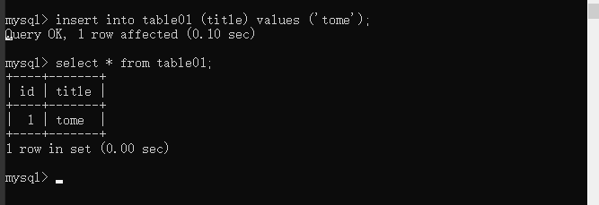

## MySQL 查询数据

---

语法 :

> SELECT column_name, column_name
> FROM table_name
> [WHERE Clause][limit n][ OFFSET M]

- 查询语句中你可以使用一个或者多个表，表之间使用逗号(,)分割，并使用 WHERE 语句来设定查询条件。
- SELECT 命令可以读取一条或者多条记录。
- 你可以使用星号（\*）来代替其他字段，SELECT 语句会返回表的所有字段数据
- 你可以使用 WHERE 语句来包含任何条件。
- 你可以使用 LIMIT 属性来设定返回的记录数。
- 你可以通过 OFFSET 指定 SELECT 语句开始查询的数据偏移量。默认情况下偏移量为 0。
- OFFSET 要配合 LIMIT 一起使用

为了演示该语法, 让我们再去添加一些数据吧

```SQL
# 添加更多的数据
INSERT INTO table01 (title) VALUES ('tony');
INSERT INTO table01 (title) VALUES ('lily');
INSERT INTO table01 (title) VALUES ('lucy');
INSERT INTO table01 (title) VALUES ('jack');

# 查询所有
SELECT * FROM table01;

# 只查询 title 列
SELECT title FROM table01;

# 只查询 title 为 tony 的列
SELECT * FROM table01 WHERE title = 'tony';

# 限制查询的数量
SELECT * FROM table01 LIMIT 2;

# 设置查询数据的偏移量
SELECT * FROM table01 LIMIT 2 OFFSET 1;

```

如图<br/>
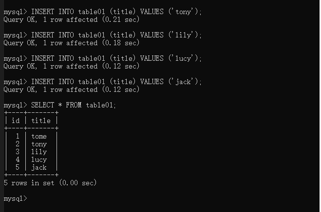 <br/>
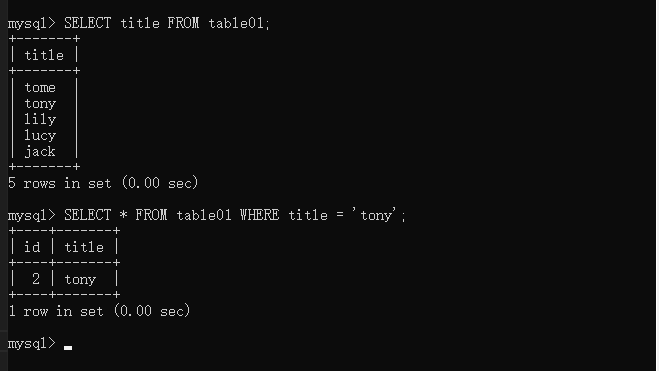 <br/>
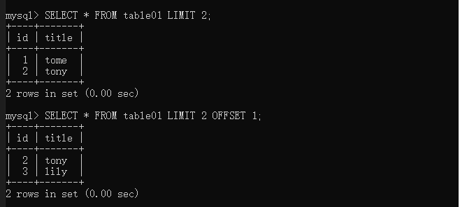

## MySQL WHERE 子句

---

语法 :

> SELECT field1, field2,...fieldN FROM table_name1, table_name2...
> [WHERE condition1 [AND [OR]] condition2.....

- 查询语句中你可以使用一个或者多个表，表之间使用逗号, 分割，并使用 WHERE 语句来设定查询条件。
- 你可以在 WHERE 子句中指定任何条件。
- 你可以使用 AND 或者 OR 指定一个或多个条件。
- WHERE 子句也可以运用于 SQL 的 DELETE 或者 UPDATE 命令。
- WHERE 子句类似于程序语言中的 if 条件，根据 MySQL 表中的字段值来读取指定的数据。
- WHERE 子句可以使用常用的比较运算符, 借图 :
  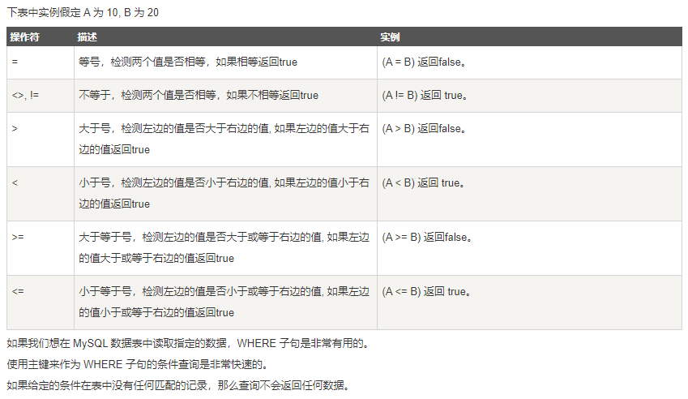

```SQL
SELECT title FROM table01 WHERE title = "tome" AND title = "tony";
SELECT title FROM table01 WHERE title = "tome" OR title = "tony";
```

如图<br/>
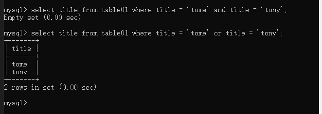

## MySQL UPDATE 更新

---

语法 :

> UPDATE table_name SET field1=new-value1, field2=new-value2
> [WHERE Clause]

- 你可以同时更新一个或多个字段。
- 你可以在 WHERE 子句中指定任何条件。
- 你可以在一个单独表中同时更新数据。

```SQL
# 看下表结构先
SELECT * FROM table01;

# 修改 title = tome 的字段, 将 tome 改为 newtome
UPDATE table01 SET title = "newtome" WHERE id = 1;

# 查看修改结果
SELECT * FROM table01;
```

如图<br/>
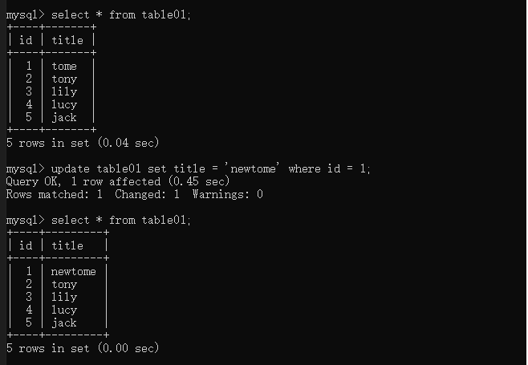

## MySQL DELETE 语句

---

语法 :

> DELETE FROM table_name [WHERE Clause]

- 如果没有指定 WHERE 子句，MySQL 表中的所有记录将被删除。
- 你可以在 WHERE 子句中指定任何条件

```SQL
# 查看表内容
SELECT * FROM table01;

# 删除 id = 1 的这一行数据
DELETE FROM table01 WHERE id = 1;

# 再次查看表内容
SELECT * FROM table01;
```

如图<br/>
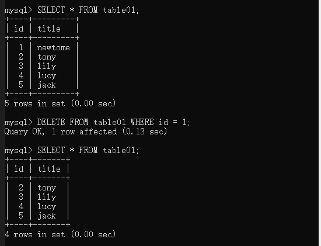

## MySQL LIKE 子句

---

_SQL LIKE 子句中使用百分号 %字符来表示任意字符，类似于 UNIX 或正则表达式中的星号 \*。_

_如果没有使用百分号 %, LIKE 子句与等号 = 的效果是一样的。_

语法 :

> SELECT field1, field2,...fieldN
> FROM table_name
> WHERE field1 LIKE condition1 [AND [OR]] filed2 = 'somevalue'

- 你可以在 WHERE 子句中指定任何条件。
- 你可以在 WHERE 子句中使用 LIKE 子句。
- 你可以使用 LIKE 子句代替等号 =。
- LIKE 通常与 % 一同使用，类似于一个元字符的搜索。
- 你可以使用 AND 或者 OR 指定一个或多个条件。
- 你可以在 DELETE 或 UPDATE 命令中使用 WHERE...LIKE 子句来指定条件。
- 该字段可用于做模糊查询

```SQL
# 查询 title 中带有 y 字符的行
SELECT * FROM table01 WHERE title LIKE "%y";
```

如图<br/>
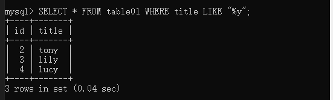

## MySQL UNION 操作符

---

_MySQL UNION 操作符用于连接两个以上的 SELECT 语句的结果组合到一个结果集合中。多个 SELECT 语句会删除重复的数据。_

语法 :

> SELECT expression1, expression2, ... expression_n
> FROM tables
> [WHERE conditions]
> UNION [ALL | DISTINCT]
> SELECT expression1, expression2, ... expression_n
> FROM tables
> [WHERE conditions];

- expression1, expression2, ... expression_n: 要检索的列。
- tables: 要检索的数据表。
- WHERE conditions: 可选， 检索条件。
- DISTINCT: 可选，删除结果集中重复的数据。默认情况下 UNION 操作符已经删除了重复数据，所以 DISTINCT 修饰符对结果没啥影响。
- ALL: 可选，返回所有结果集，包含重复数据。

```SQL
# 再建一个表 table02
CREATE TABLE table02 ( id INT AUTO_INCREMENT, title VARCHAR(100), PRIMARY KEY (id) );

# 往 table02 中插入几条数据, 数据中包含几个和 table01 重复的数据
INSERT INTO table02 (title) VALUES ("tony");
INSERT INTO table02 (title) VALUES ("lily");
INSERT INTO table02 (title) VALUES ("lucy");
INSERT INTO table02 (title) VALUES ("tome");
INSERT INTO table02 (title) VALUES ("haha");

# 用 union 整合数据
SELECT * FROM table01 UNION DISTINCT SELECT * FROM table02;
SELECT title FROM table01 UNION DISTINCT SELECT title FROM table02;

```

如图<br/>
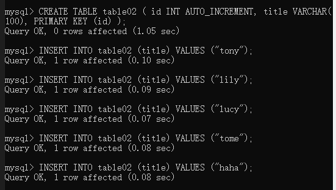<br/>
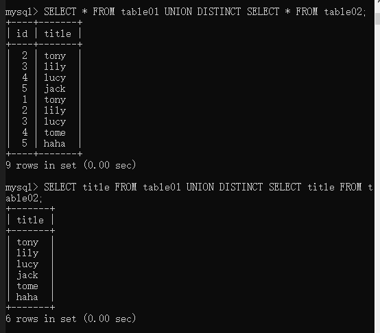<br/>

`注意 : 如图, select 必须要指定检索的列, 否则不能去重`

## MySQL 排序

---

语法 :

> SELECT field1, field2,...fieldN FROM table_name1, table_name2...
> ORDER BY field1 [ASC [DESC][默认 asc]], [field2...]ASC [DESC][默认 asc]]

- 你可以使用任何字段来作为排序的条件，从而返回排序后的查询结果。
- 你可以设定多个字段来排序。
- 你可以使用 ASC 或 DESC 关键字来设置查询结果是按升序或降序排列。 默认情况下，它是按升序排列。
- 你可以添加 WHERE...LIKE 子句来设置条件。

```SQL
# 将 table01 的数据以 id 降序来查询
SELECT * FROM table01 ORDER BY id DESC;
```

如图<br/>
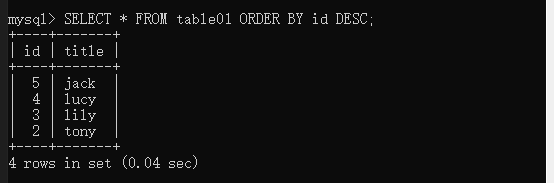

## MySQL GROUP BY 语句(分组)

---

_GROUP BY 语句根据一个或多个列对结果集进行分组。_

_在分组的列上我们可以使用 COUNT, SUM, AVG,等函数。_

语法 :

> SELECT column_name, function(column_name)
> FROM table_name
> WHERE column_name operator value
> GROUP BY column_name;

- function(column_name) 是 COUNT, SUM, AVG 等函数, column_name 是要操作的列名
- 用 SELECT 查询出来的列可以用 AS 来重命名
- WITH ROLLUP 可以实现在分组统计数据基础上再进行相同的统计（SUM,AVG,COUNT…）
- 使用 coalesce 来设置一个可以取代 NUll 的名称<br/>

  语法

  > select coalesce(a,b,c);

  - 如果 a==null,则选择 b；如果 b==null,则选择 c；如果 a!=null,则选择 a；如果 a b c 都为 null ，则返回为 null（没意义）

```SQL
# 将 table01 中的数据以 title 来分组
SELECT title, COUNT(*) FROM table01 GROUP BY title;

# 用 as 将查询的数据重命名
SELECT title, COUNT(*) AS title_count FROM table01 GROUP BY title;

# 用 WITH ROLLUP 对数据进行再次统计
SELECT title, COUNT(*) AS title_count FROM table01 GROUP BY title WITH ROLLUP;

# 用 coalesce 处理 NULL
SELECT COALESCE(title, "total"), COUNT(*) AS title_count FROM table01 GROUP BY title WITH ROLLUP;
```

如图<br/>
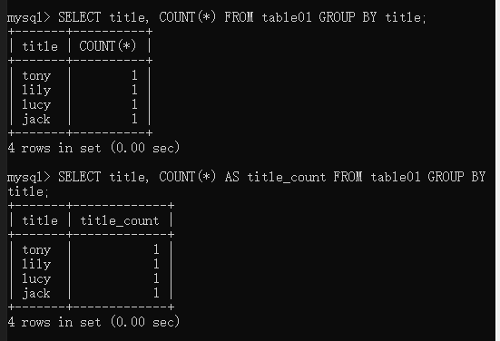<br/>
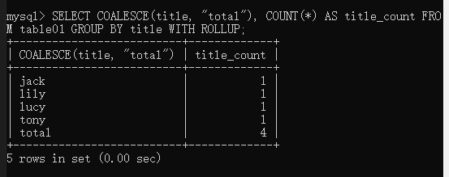<br/>

## MySQL 连接的使用

---

_本章节我们将向大家介绍如何使用 MySQL 的 `JOIN` 在两个或多个表中查询数据。_

_你可以在 SELECT, UPDATE 和 DELETE 语句中使用 Mysql 的 `JOIN` 来联合多表查询。_

语法 : JOIN 按照功能大致分为如下三类：

- INNER JOIN（内连接,或等值连接）：获取两个表中字段匹配关系的记录。
- LEFT JOIN（左连接）：获取左表所有记录，即使右表没有对应匹配的记录。
- RIGHT JOIN（右连接）： 与 LEFT JOIN 相反，用于获取右表所有记录，即使左表没有对应匹配的记录。

```SQL
# 使用 INNER JOIN (也可以省略 INNER 使用 JOIN，效果一样)
SELECT a.id, b.title FROM table01 a INNER JOIN table02 b ON a.id = b.id;

# 使用 LEFT JOIN 获取左表所有记录，即使右表没有对应匹配的记录。
SELECT a.id, b.title FROM table01 a LEFT JOIN table02 b ON a.id = b.id;

# 使用 RIGHT JOIN 获取右表所有记录，即使左表没有对应匹配的记录
SELECT a.id, b.title FROM table01 a RIGHT JOIN table02 b ON a.id = b.id;
```

如图<br/>
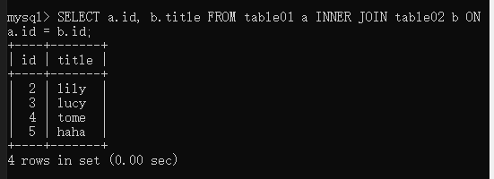<br/>
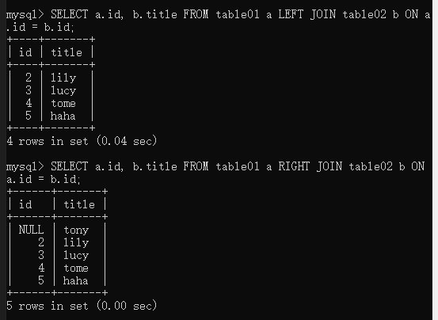<br/>

## MySQL NULL 值处理

---

_我们已经知道 MySQL 使用 SQL SELECT 命令及 WHERE 子句来读取数据表中的数据,但是当提供的查询条件字段为 NULL 时，该命令可能就无法正常工作_

语法 : MySQL 提供了三大运算符

- IS NULL: 当列的值是 NULL,此运算符返回 true。
- IS NOT NULL: 当列的值不为 NULL, 运算符返回 true。
- <=>: 比较操作符（不同于 = 运算符），当比较的的两个值相等或者都为 NULL 时返回 true。

关于 NULL 的条件比较运算是比较特殊的。你不能使用 = NULL 或 != NULL 在列中查找 NULL 值

在 MySQL 中，NULL 值与任何其它值的比较（即使是 NULL）永远返回 NULL，即 NULL = NULL 返回 NULL

MySQL 中处理 NULL 使用 IS NULL 和 IS NOT NULL 运算符

> 注意 ：
>
> select \*, columnName1 + ifnull(columnName2,0) from tableName;
>
> columnName1，columnName2 为 int 型，当 columnName2 中，有值为 null 时，columnName1+columnName2=null， ifnull(columnName2,0) 把 columnName2 中 null 值转为 0

```SQL
# 创建 table03
CREATE TABLE table03 (id INT AUTO_INCREMENT, title VARCHAR(100), age INT, PRIMARY KEY (id));

# 添加 5 条数据给 table03
INSERT INTO table03 (title) VALUES ("TOMS");
INSERT INTO table03 (title, age) VALUES ("ALPHA", 16);
INSERT INTO table03 (title, age) VALUES ("BLOON", 18);
INSERT INTO table03 (title, age) VALUES ("CRITR", 20);
INSERT INTO table03 (title) VALUES ("DIRROO");

# 查询 age 为空的数据
SELECT * FROM table03 WHERE age IS NULL;

# 查询 age 不为空的数据
SELECT * FROM table03 WHERE age IS NOT NULL;

# 把 id 和 age 相加
SELECT *, id + ifnull(age, 0) FROM table03;

```

如图<br/>
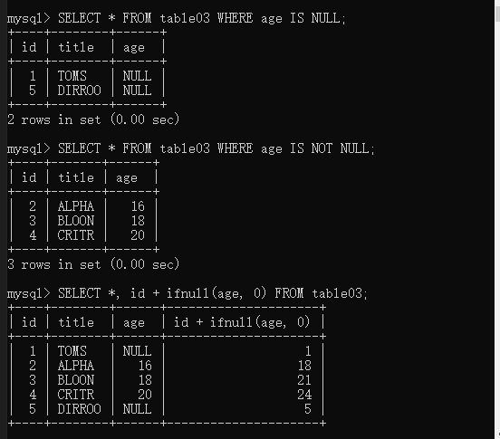

## MySQL 正则表达式

---

借图<br/>
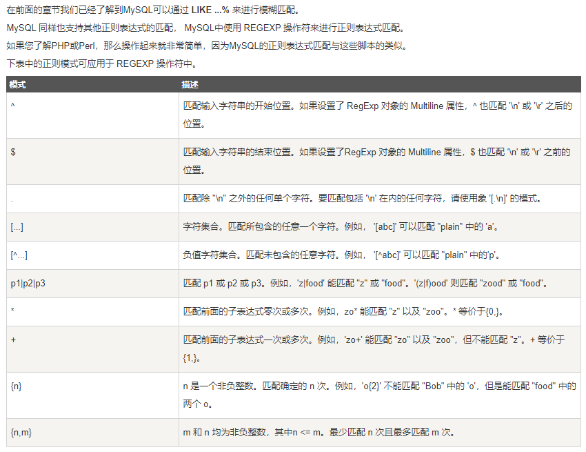

> SELECT column1, column2... FROM table_name WHERE column1 REGEXP regexp, column...;

```SQL
# 筛选 title 中带 y 的数据
SELECT title FROM table01 WHERE title REGEXP 'y';

# 筛选 title 中带 o 的数据
SELECT title FROM table01 WHERE title REGEXP 'o';
```

如图<br/>
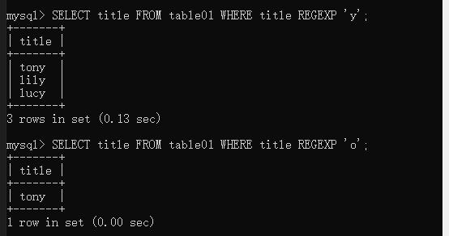

## MySQL 事务

---

语法 :

> xxx

```SQL

```

如图<br/>


## MySQL ALTER 命令

---

语法 :

> xxx

```SQL

```

如图<br/>


## MySQL 索引

---

语法 :

> xxx

```SQL

```

如图<br/>


## MySQL 临时表

---

语法 :

> xxx

```SQL

```

如图<br/>


## MySQL 复制表

---

语法 :

> xxx

```SQL

```

如图<br/>


## MySQL 元数据

---

语法 :

> xxx

```SQL

```

如图<br/>


## MySQL 序列使用

---

语法 :

> xxx

```SQL

```

如图<br/>


## MySQL 处理重复数据

---

语法 :

> xxx

```SQL

```

如图<br/>


## MySQL SQL 注入

---

语法 :

> xxx

```SQL

```

如图<br/>


## MySQL 导出数据

---

语法 :

> xxx

```SQL

```

如图<br/>


## MySQL 导入数据

---

语法 :

> xxx

```SQL

```

如图<br/>


## MySQL 函数

---

语法 :

> xxx

```SQL

```

如图<br/>


## MySQL 运算符

---

语法 :

> xxx

```SQL

```

如图<br/>


## MySQL xxx

---

语法 :

> xxx

```SQL

```

如图<br/>

